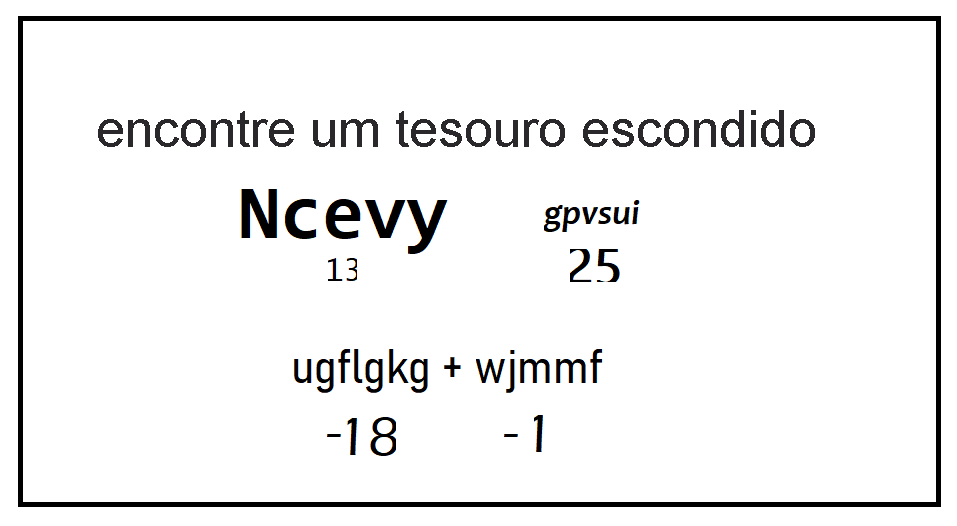

# repositorioPython
 exercicios de python - jogos no pygame - analise e ciêcia de dados

<h1>codigo de descriptografia</h1>

o codigo se trata de descriptografar a mensagem da foto

treinamento proposto pela Learn Microsoft

